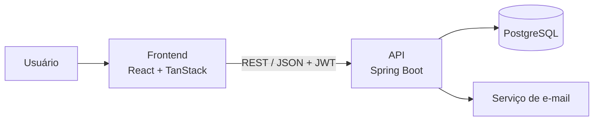

<div align="center">

# 🚗 Service Flow

### Gestão operacional e financeira para prestadores de serviços

[](https://www.java.com/)
[](https://spring.io/projects/spring-boot)
[](https://react.dev/)
[](https://www.typescriptlang.org/)
[](https://www.postgresql.org/)

[Aplicação](https://serviceflow-frontend-xi.vercel.app) · [API](https://github.com/joavlr03/service-flow-api) · [Frontend](https://github.com/joavlr03/serviceflow-frontend)

</div>

---

## Sobre o Service Flow

O **Service Flow** é uma plataforma de gestão para empresas prestadoras de serviços. O produto centraliza clientes, veículos, catálogo de serviços, agenda, ordens de serviço, despesas e indicadores financeiros em um único fluxo.

O projeto nasceu para atender a operação de um lava-rápido, substituindo controles dispersos em papel, planilhas e conversas por uma experiência simples, mobile-first e preparada para evoluir como uma solução SaaS multiempresa.

## Repositórios

| Projeto | Responsabilidade | Tecnologias | Repositório |
| --- | --- | --- | --- |
| **Service Flow API** | Regras de negócio, autenticação, persistência e API REST | Java 21, Spring Boot 3.5, Spring Security, JPA, Flyway e PostgreSQL | [Acessar backend](https://github.com/joavlr03/service-flow-api) |
| **Service Flow Frontend** | Interface web responsiva e aplicativo Android via Capacitor | React 19, TypeScript, TanStack, Tailwind CSS, Vite e Capacitor | [Acessar frontend](https://github.com/joavlr03/serviceflow-frontend) |

## Arquitetura



O frontend consome a API REST versionada em `/api/v2`. A API concentra as regras de negócio, protege os recursos com JWT e utiliza migrações Flyway para manter a estrutura do banco de dados.

## Funcionalidades

- Autenticação com renovação de sessão e recuperação de senha;
- cadastro inicial da empresa e do proprietário;
- gestão de clientes e seus veículos;
- catálogo de tipos de serviço;
- criação e acompanhamento de ordens de serviço;
- agenda diária de atendimentos;
- atualização de status de serviços;
- registro de despesas;
- dashboard operacional e resumo financeiro;
- separação dos dados por empresa.

## Executando o ecossistema localmente

### Requisitos

- Git;
- Java 21;
- Maven 3.9 ou superior;
- Node.js e npm;
- Docker, recomendado para executar o PostgreSQL.

### 1. Backend

```bash
git clone https://github.com/joavlr03/service-flow-api.git
cd service-flow-api
docker compose up -d
mvn spring-boot:run
```

A API será iniciada em `http://localhost:9000`. A documentação Swagger fica disponível na rota raiz.

### 2. Frontend

Em outro terminal:

```bash
git clone https://github.com/joavlr03/serviceflow-frontend.git
cd serviceflow-frontend
cp .env.example .env
npm install
npm run dev
```

Para desenvolvimento local, configure o arquivo `.env` com:

```env
VITE_API_URL=http://localhost:9000/api/v2
```

O frontend será iniciado normalmente em `http://localhost:8080`.

> No PowerShell, use `Copy-Item .env.example .env` no lugar de `cp .env.example .env`.

## Estrutura dos projetos

```text
Service Flow
├── service-flow-api/          # API REST e regras de negócio
│   ├── docs/                  # Contrato OpenAPI
│   └── src/
│       ├── main/java/         # Aplicação Spring Boot
│       └── main/resources/    # Configurações e migrações Flyway
│
└── serviceflow-frontend/      # Interface web e aplicativo Android
    ├── android/               # Projeto nativo gerado pelo Capacitor
    ├── public/                # Recursos públicos
    └── src/
        ├── components/        # Componentes da interface
        ├── lib/               # Cliente da API, estado e utilitários
        └── routes/            # Telas e rotas da aplicação
```

## Fluxo principal

1. O administrador cadastra o cliente, o veículo e o serviço.
2. Uma ordem de serviço reúne os dados do atendimento, data, horário e valor.
3. A ordem passa a compor a agenda e o faturamento previsto.
4. A mudança de status registra a conclusão ou o cancelamento.
5. Serviços finalizados alimentam a receita realizada e os indicadores.

## Testes e qualidade

No backend:

```bash
mvn test
```

No frontend:

```bash
npm run lint
npm run build
```

## Documentação da API

O contrato OpenAPI versionado está disponível em [`docs/openapi.yaml`](docs/openapi.yaml). Com a API em execução, use o Swagger para explorar e testar os endpoints.

## Deploy no Google Cloud Run

A API roda em container (`Dockerfile` na raiz do projeto) e escala a zero quando ociosa.

**Build e deploy:**

```bash
gcloud run deploy serviceflow-api \
  --source . \
  --region southamerica-east1 \
  --allow-unauthenticated \
  --set-env-vars DB_URL=jdbc:postgresql://<host-neon>/<db>,DB_USERNAME=<user>,DB_PASSWORD=<senha>,JWT_SECRET=<segredo>,CORS_ALLOWED_ORIGINS=<url-do-frontend>
```

O Cloud Run injeta a variável `PORT` automaticamente (a aplicação já lê `${PORT:9000}` em `application.yml`, então não precisa configurar nada extra).

**Variáveis de ambiente:**

| Variável | Obrigatória | Descrição |
|---|---|---|
| `DB_URL` | sim | Connection string do Postgres (usar a string com pooling/PgBouncer do Neon) |
| `DB_USERNAME` / `DB_PASSWORD` | sim | Credenciais do banco |
| `JWT_SECRET` | sim | Segredo usado para assinar os tokens de acesso |
| `CORS_ALLOWED_ORIGINS` | recomendada | Domínio(s) do frontend em produção |
| `MAIL_ENABLED`, `MAIL_HOST`, `MAIL_USERNAME`, `MAIL_PASSWORD` | não | Envio de e-mail (desativado por padrão) |
| `ACCESS_TOKEN_MINUTES`, `AUTH_RATE_LIMIT_ATTEMPTS`, `AUTH_RATE_LIMIT_WINDOW_MINUTES` | não | Ajustes de segurança, têm padrão |

**Teste local do container antes do deploy:**

```bash
docker build -t serviceflow-api .
docker run -p 8080:8080 -e PORT=8080 -e DB_URL=... -e DB_USERNAME=... -e DB_PASSWORD=... -e JWT_SECRET=... serviceflow-api
```

---

<div align="center">

Desenvolvido para simplificar a rotina de quem presta serviços.

</div>
